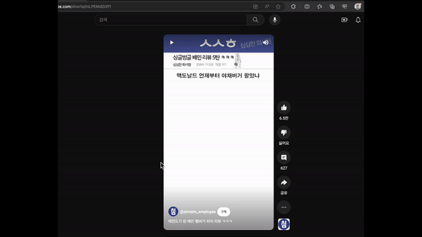
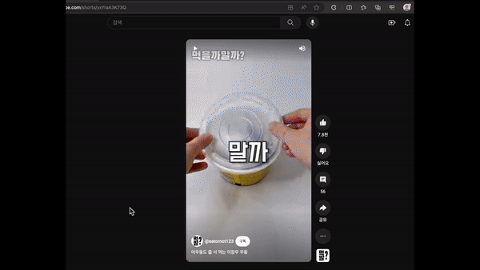
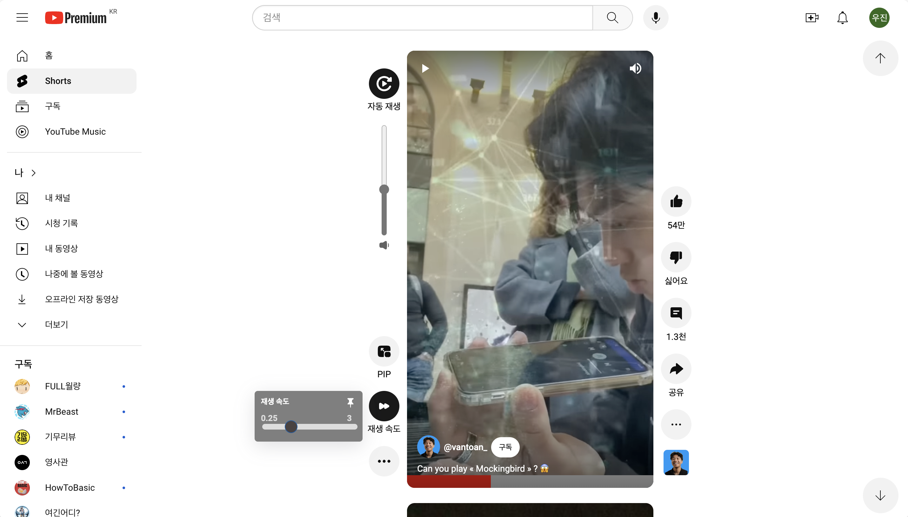
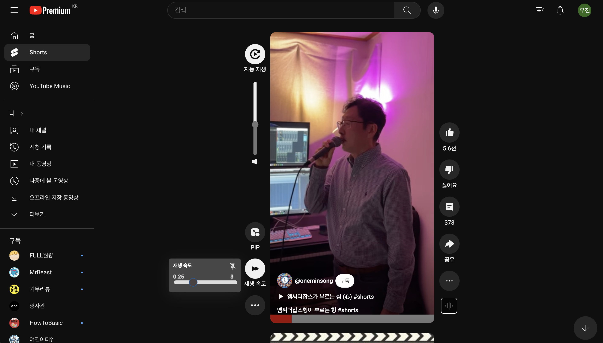

# 유튜브 쇼츠 컨트롤 - 크롬 확장프로그램

#### 유튜브 쇼츠를 제어 할 수 있는 컨트롤이 생성됩니다!
#### 다음과 같이 유튜브 쇼츠를 제어 할 수 있습니다.

---

- 자동 재생 : 영상 시간이 끝나면 자동으로 다음 영상이 재생됩니다.
- 재생바 :  쇼츠 하단에 재생바를 이용해 영상 시간을 변경할 수 있습니다.
- 볼륨 조절 : 다음 영상 혹은 브라우저 재시작 후에도 적용됩니다.
- PIP : PIP 상태에도 자동 재생이 가능하며, ‘볼륨’, ‘재생 속도’도 유지됩니다.
- 재생 속도 : 0.25 ~ 3 배속으로 조절이 가능하며, 핀으로 고정 시 다음 영상 혹은 브라우저 재시작 후에도 유지 됩니다.
---

## 적용 전

## 적용 후

  

  

